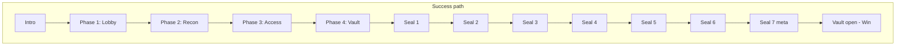
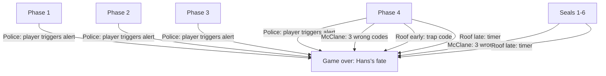
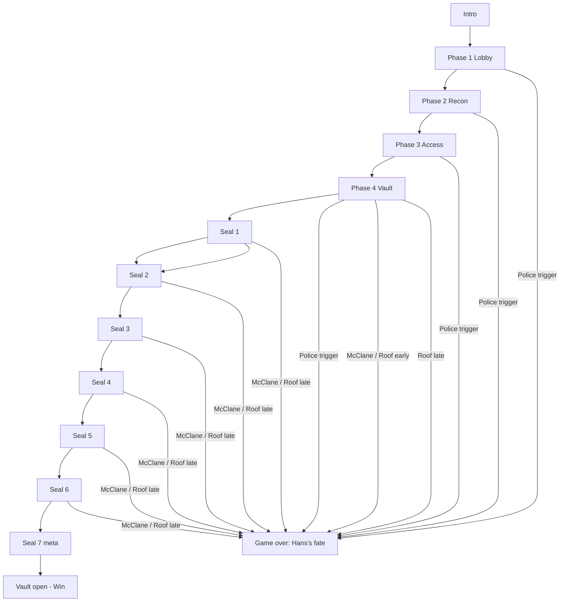
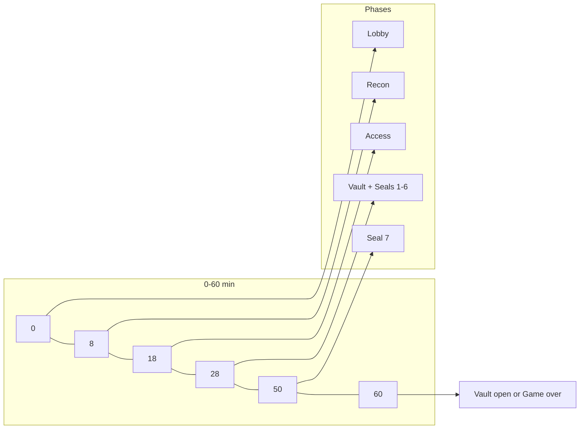

# Nakatomi Plaza: Vault Heist — Timeline and Flows

This document defines the game timeline (phase checkpoints, threat escalation) and all possible flows (success path and failure branches). Use it for facilitation and for implementing timers, triggers, and narrative. **Police breach** is triggered by a player action tied to the movie; **McClane** is introduced with a first hint when he appears in the film, then follow-up hints throughout the game in line with the movie’s sequence.

---

## 1. Overview

- **Total game length**: 45–60 minutes from “Go” (after intro). Intro (1–2 min) is not counted.
- **Success**: Complete all phases and open all 7 seals → vault open, get the bonds.
- **Game over**: Any fail condition → same ending (Hans’s fate: dropped from the building). Fail conditions are: **police breach** (player-triggered, movie-tied), **McClane** (e.g. too many wrong seal codes), **roof early** (trap action), **roof late** (timer).
- **McClane hints**: Separate from the “McClane kills you” lose condition. Hints are atmosphere and foreshadowing, scheduled to match the movie; the actual game over is when players trigger the lose rule (e.g. 3 wrong seal codes).

---

## 2. Phase timeline

| Phase | Start (elapsed) | End (elapsed) | Duration | Goal | McClane hint |
|-------|------------------|---------------|----------|------|--------------|
| **Phase 1 — Lobby** | 0:00 | 0:08 | ~8 min | Enter lobby data; prove you’re in the system. | **First hint** (end of phase): “Unaccounted for person in building” / McClane in the building. |
| **Phase 2 — Secure building / recon** | 0:08 | 0:18 | ~10 min | Map building; find vault floor. | Radio traffic / “Officer requesting backup” (wrong channel). |
| **Phase 3 — Takagi refused / access** | 0:18 | 0:28 | ~10 min | Find bypass code or badge; unlock vault phase. | Personnel down / “We’ve lost contact” (henchmen). |
| **Phase 4 — Vault (seals 1–6)** | 0:28 | 0:50 | ~22 min | Open six seals with codes from Splunk. | Movement in HVAC / roof access / “Just another American who saw too many movies.” |
| **Seal 7 (meta)** | 0:50 | 0:60 | ~10 min | Physical trick; vault open or time’s up. | “He’s here” / final confrontation (if not yet won). |

*Suggested windows; tune in playtests.*

---

## 3. Threat timeline and fail conditions

### 3.1 Police breach — movie-tied trigger

**Movie**: The police get involved when something reaches the outside world (e.g. first 911 call, building alarm, or media report). It’s a consequence of a specific story event, not a generic timer.

**In-game trigger**: The breach is triggered when players **do something** that in the story counts as “alerting the outside world.” Choose one (or combine):

- **Option A — Player action in Splunk**: Players run a certain search or open a certain dashboard that narrative-wise “trips an external alert” or “sends a signal to building security / LAPD.” Example: they pull a “restricted” or “emergency” report that is tied to “the building has been reported to the police.”
- **Option B — Trap code or decoy procedure**: Players enter a trap code (e.g. “emergency override”) or follow a decoy procedure from the logs that in-story triggers the alarm or a 911.
- **Option C — Milestone + delay**: When players complete a specific milestone or access specific data, the facilitator or game engine marks “police notified.” After a short delay (e.g. 5–10 min), the police breach.

**Documentation for facilitators**: “Police breach: triggered when players [specific action or milestone]. In the movie, the police are called when [e.g. alarm / 911 / Thornburg report]. In the game, [action] counts as that moment. Breach occurs [immediately / after N minutes].” Add the chosen trigger and delay to your run sheet.

### 3.2 McClane — hints vs. game over

- **McClane hints**: First hint when he first matters in the movie (crew realizes someone’s loose); then follow-up hints at phases/times that match the film (see Section 4). These are **atmosphere only** — they do not by themselves cause game over.
- **McClane game over**: A separate rule. Example: **3 wrong seal codes** (on the physical vault model) = “McClane got the drop on you” → game over → Hans’s fate. Implement as a wrong-code counter; when it hits the limit, declare game over.

### 3.3 Roof early

- **Trigger**: Players perform a “wrong” action that maps to triggering the roof charges early (e.g. enter a decoy/trap code from the logs, or follow a decoy procedure).
- **When**: During Phase 4 (vault work).
- **Result**: “You triggered the charges early.” → Game over → Hans’s fate.

### 3.4 Roof late

- **Trigger**: Timer reaches 0:55 or 1:00 and not all 7 seals are open.
- **Result**: “The charges blew. You never got the vault.” → Game over → Hans’s fate.

---

## 4. McClane timeline (first hint + follow-up hints)

### 4.1 First hint

- **When**: End of Phase 1 (Lobby) or start of Phase 2 (Secure building). Mirrors “we’ve secured the lobby but we’ve got a problem.”
- **Movie tie**: First time the crew realizes someone’s loose in the building (McClane escaped the initial sweep).
- **Form**: One of: log entry (“Unaccounted for person in building,” “Hostile contact — floor 30,” “Someone’s not in the party count”), dashboard panel, or one-line narrative. Optional easter egg: “I was in the neighborhood” in a log.

### 4.2 Follow-up hints (movie order)

Schedule these so they appear in an order that roughly matches the film. Inject via new log events, narrative, or facilitator lines at the given phase or time.

| Movie beat | Game phase or time | Hint (log / narrative / facilitator) | Optional easter egg |
|------------|--------------------|--------------------------------------|----------------------|
| McClane gets a radio | Phase 2 | “Radio traffic — unknown unit” or “Officer requesting backup” (wrong channel). | — |
| McClane takes out henchmen | Phase 3 | “Personnel down — floor X,” “We’ve lost contact with [name],” “Hostile engagement.” | — |
| McClane in the vents / moving | Phase 4 (early) | “Movement in HVAC,” “Sensor trigger — no ID.” | “Just another American who saw too many movies.” |
| McClane and the C4 / roof | Phase 4 (mid) | “Roof access — unauthorized,” “Explosives tampered,” “Someone’s on the roof.” | — |
| McClane vs. Hans / final confrontation | Phase 4 (late) or Seal 7 | “He’s here.” / “That’s the guy from the tower.” | — |

---

## 5. Success path

One linear path to victory:

1. Intro (read before play).
2. **Phase 1 — Lobby**: Prove you’re in the system (first search/dashboard).
3. **Phase 2 — Secure building**: Map the building; find vault floor.
4. **Phase 3 — Takagi refused**: Find bypass code or badge; unlock vault phase.
5. **Phase 4 — Vault**: Open Seal 1 → Seal 2 → … → Seal 6 (codes from Splunk).
6. **Seal 7**: Perform the meta solution (e.g. unplug power).
7. **Vault open** → Success ending (get the bonds; “Yippee-ki-yay” style).

**Condition**: Complete every phase and open all 7 seals **before** any fail condition triggers.

---

## 6. Failure branches

All branches lead to the same game-over ending: **Hans’s fate** (dropped from the building).

| Branch | When | Trigger | Game-over line (example) |
|--------|------|---------|---------------------------|
| **Police breach** | After player triggers “alert” | Player action (wrong search, trap code, or milestone that maps to “police notified” in the movie). Optionally: breach after N min delay. | “SWAT has the building. You’re arrested.” → Hans’s fate. |
| **McClane** | Phase 4 (vault) | e.g. 3 wrong seal code attempts on the physical model. | “McClane got the drop on you.” → Hans’s fate. |
| **Roof early** | Phase 4 | Player enters decoy/trap code or follows decoy procedure from logs. | “You triggered the charges early.” → Hans’s fate. |
| **Roof late** | 0:55–1:00 | Timer expires before all 7 seals open. | “The charges blew. You never got the vault.” → Hans’s fate. |

---

## 7. Flow diagrams (graphical)

### 7.1 Success path (linear)

The only way to win: complete every step in order with no fail condition triggering.

### 7.2 Failure branches (all lead to game over)

Any of these triggers ends the game with Hans’s fate. They can occur from the phases/seals shown.

### 7.3 Full flow (success + failures)

One diagram with the main path and every failure branch.

### 7.4 Timeline (phases over time)

When each phase runs (elapsed minutes). Fail conditions: **Police** = any time after player triggers alert; **McClane** = Phase 4 / seals (wrong codes); **Roof early** = Phase 4 (trap code); **Roof late** = 0:55–1:00.

To view all diagrams rendered in a browser, open [flow.html](flow.html) from the `docs` folder.

---

## 8. Facilitator notes

- **Start the clock**: When you say “Go” after the intro. Total time 45–60 min.
- **Police breach**: Note the chosen trigger (player action or milestone) and optional delay. When it happens, announce breach and game over (Hans’s fate).
- **McClane hints**: Inject or reveal at the phase/time in Section 4 (first hint + follow-up table). These are flavor only.
- **McClane game over**: Track wrong seal code attempts. At the limit (e.g. 3), announce “McClane got the drop on you” and game over.
- **Roof early**: If players use the defined trap code or decoy procedure, announce roof early and game over.
- **Roof late**: If the clock hits the limit (e.g. 0:55) and the vault isn’t open, announce roof late and game over.
- **Success**: When all 7 seals are open, announce success ending (vault open, get the bonds).
- **Reset and replay**: After each run, reset the physical vault (all seals closed), clear any wrong-code counter, and restart the clock for the next team.
